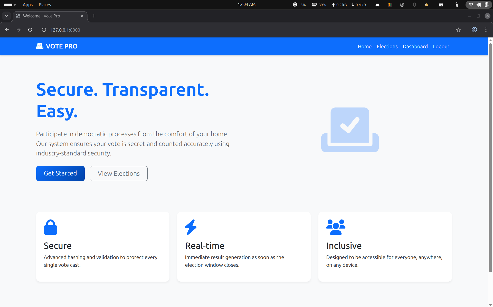
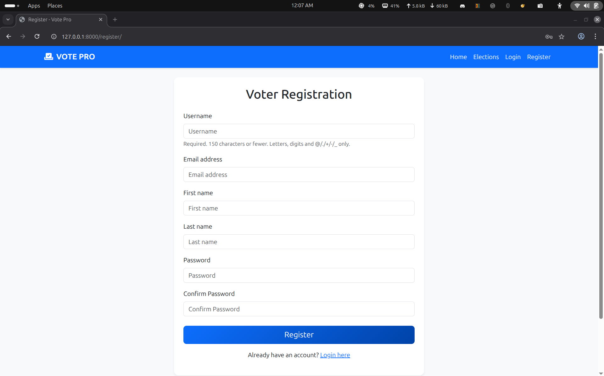
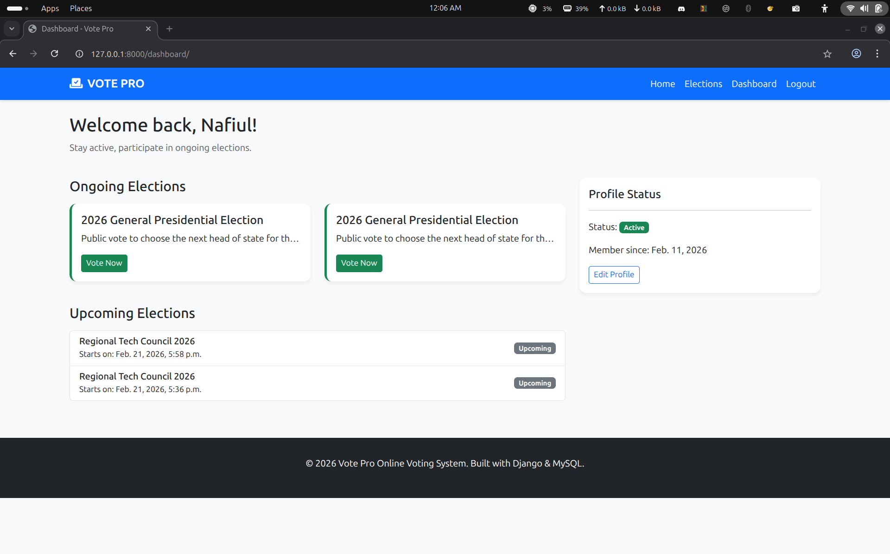
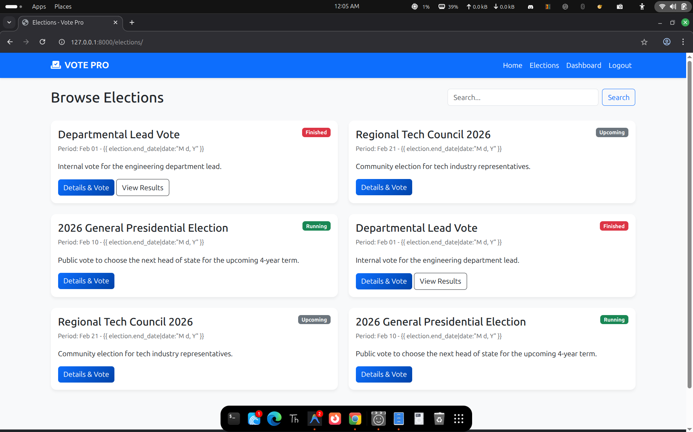
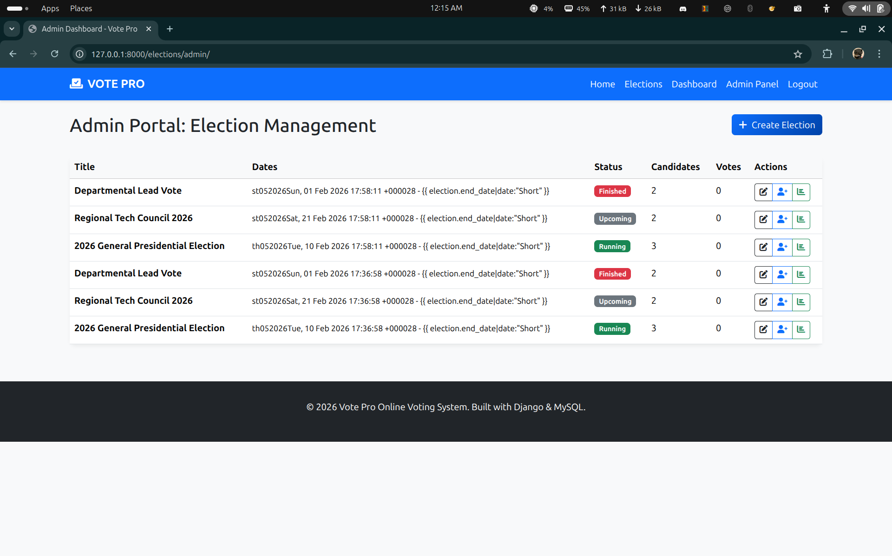

# Vote Pro (Django + MySQL)

A complete, production-ready Vote Pro system built with Django 4.2+ and MySQL. This system provides a secure and transparent platform for managing elections, candidates, and voting processes.

## Features

### For Voters
- Secure Registration & Login: Django-backed authentication.
- Voter Dashboard: View ongoing and upcoming elections.
- One-Vote Constraint: System prevents multiple votes per election (database-level enforcement).
- Live Results: View winners and vote breakdowns after an election finishes.
- Search: Find elections by title or description.

### For Admins
- Election Management: Create, Edit, and monitor elections (Upcoming, Running, Finished).
- Candidate Management: Add candidates with bios and images to specific elections.
- Voter Control: View all registered voters and block/unblock accounts.
- Audit Logs: Simple background logging of every vote cast.
- Real-time Results: Immediate winner determination based on vote counts.

## Screenshots

| Home Page | Registration Page |
|---|---|
|  |  |

| Voter Dashboard | Election List |
|---|---|
|  |  |

| Admin Panel | Example View |
|---|---|
|  |  |

## Tech Stack
- Backend: Django
- Frontend: Bootstrap 5, FontAwesome, Django Templates
- Database: MySQL (with SQLite fallback)
- Environment: python-dotenv for configuration

## Project Structure
```text
vote-pro/
├── backend/
│   ├── manage.py
│   ├── core/           # Project settings & root URLs
│   ├── accounts/       # User management & voter profiles
│   ├── elections/      # Election & Candidate CRUD
│   ├── voting/         # Vote casting & results logic
│   ├── templates/      # Global templates (Bootstrap 5)
│   ├── static/         # CSS/JS assets
│   └── requirements.txt
├── img/                # Project screenshots
├── .env.example        # Configuration template
├── README.md
└── LICENSE
```

## Installation & Setup

### 1. Prerequisites
- Python 3.8+
- MySQL Server (optional, defaults to SQLite)
- mysqlclient dependencies (e.g., libmysqlclient-dev on Linux)

### 2. Setup environment
```bash
# Clone the repository
git clone https://github.com/nafiul-afk/vote-pro.git
cd vote-pro

# Create and activate virtual environment
python3 -m venv venv
source venv/bin/activate  # Windows: venv\Scripts\activate

# Install dependencies
pip install -r backend/requirements.txt

# Setup configuration
cp .env.example .env
```
*Note: If using MySQL, update `.env` with your database credentials.*

### 3. Initialize Database
```bash
cd backend
python manage.py migrate
python manage.py createsuperuser
```

### 4. Optional: Load Sample Data
To populate the database with example elections and candidates:
```bash
python setup_sample_data.py
```

### 5. Run Server
```bash
python manage.py runserver
```
Visit http://127.0.0.1:8000/

## Project Highlights
- **Security**: Password hashing, atomic transactions, and CSRF protection.
- **Integrity**: Unique vote constraints to prevent double-voting.
- **Flexibility**: Support for Running, Upcoming, and Finished elections.
- **Automation**: Easy sample data setup for testing.

## Security Measures
- Password Hashing: PBKDF2 (Django default).
- Atomic Transactions: Ensures vote integrity during high-concurrency casting.
- Access Control: LoginRequiredMixin and user_passes_test protect sensitive views.
- DB Integrity: unique_together constraint on (voter, election) prevents double-voting.

## License
This project is licensed under the MIT License.
